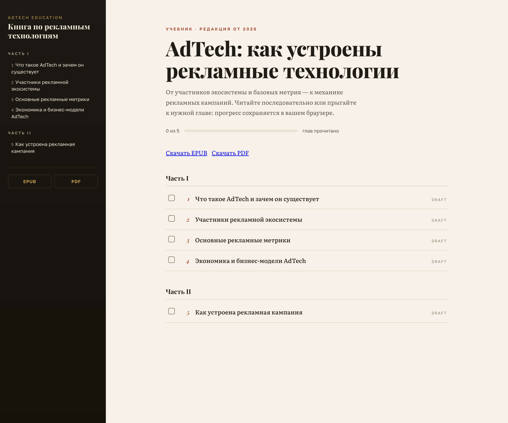
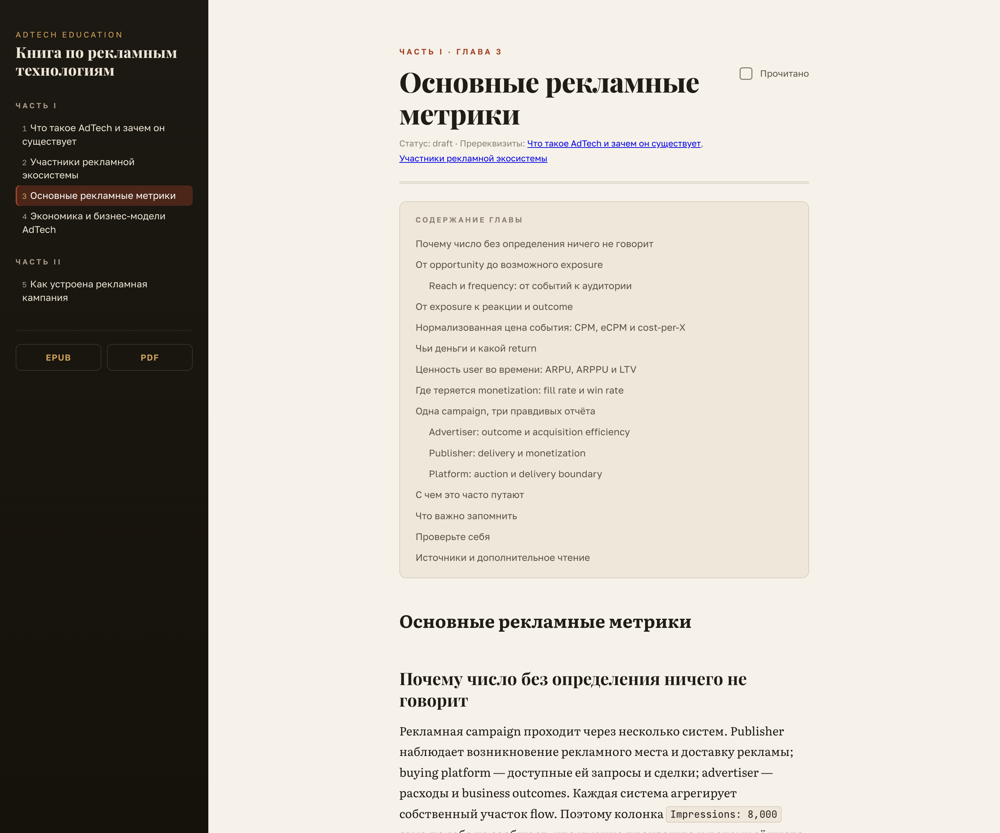

# AdTech Education

> Учебник по рекламным технологиям: от участников экосистемы и базовых метрик —
> до механики рекламных кампаний. Написан людьми вместе с ИИ, читается как книга.

**[Читать онлайн →](https://adtech101.h0b0.dev)** · [EPUB](https://adtech101.h0b0.dev/downloads/adtech-ru.epub) · [PDF](https://adtech101.h0b0.dev/downloads/adtech-ru.pdf)

[](https://github.com/yanislav-igonin/ad-tech-education/actions/workflows/deploy.yml)


| Главная | Глава |
| --- | --- |
|  |  |

---

## Что это

Курс для инженеров, которые хотят разобраться, **как на самом деле устроена digital-реклама** —
без маркетинговой воды, зато с HTTP, аукционами, метриками и деньгами.

- **Для кого**: люди с инженерным бэкграундом и нулевым знанием AdTech
- **Формат**: учебник на 55 глав, сгруппированных в части, с прогрессом чтения и офлайн-версиями
- **Язык**: русский (английский перевод — отдельный пайплайн на будущее)

## Структура книги

| Часть | Главы |
| --- | --- |
| **I — Основы** | 1. Что такое AdTech и зачем он существует · 2. Участники рекламной экосистемы · 3. Основные рекламные метрики · 4. Экономика и бизнес-модели AdTech |
| **II — Практика** | 5. Как устроена рекламная кампания |

Каждая глава — markdown-файл в [`chapters/ru/`](chapters/ru) с фронматтером: часть, номер,
статус, требования к оглавлению и пререквизиты. Сайт собирается из них автоматически.

## Как устроен сайт

Чистая статика, ноль клиентских фреймворков:

- **[Astro 7](https://astro.build)** — content collection читает `chapters/ru/*.md` прямо из репы,
  каждая глава становится страницей на билде
- **Прогресс чтения** — отметка «прочитано» живёт в `localStorage`, никакого бэкенда
- **EPUB + PDF** — генерируются при каждой сборке: pandoc для EPUB,
  pandoc → HTML → headless Chrome (raw CDP) для PDF
- **Деплой** — пуш в `master` → [GitHub Actions](.github/workflows/deploy.yml) → GitHub Pages

## Локально

```bash
# сайт
cd site
npm install
npm run dev        # http://localhost:4321

# артефакты (нужны pandoc и Chrome/Chromium)
make epub          # site/public/downloads/adtech-ru.epub
make pdf           # site/public/downloads/adtech-ru.pdf
```

## Контентный пайплайн

Главы пишутся связкой ИИ-агентов: планировщик → автор → независимый аудит → финальный редактор.
Промпты агентов лежат в [`agents/`](agents), мастер-спецификация курса — в
[`master-prompt.md`](master-prompt.md), как этим пользоваться — в
[`README-adtech.md`](README-adtech.md).

Чтобы дописать главу: кладёшь `chapters/ru/NN-slug.md` с нужным фронматтером, пушишь в
`master` — сайт, оглавление и артефакты обновятся сами.

## Лицензия

[MIT](LICENSE) © Yanislav Igonin
